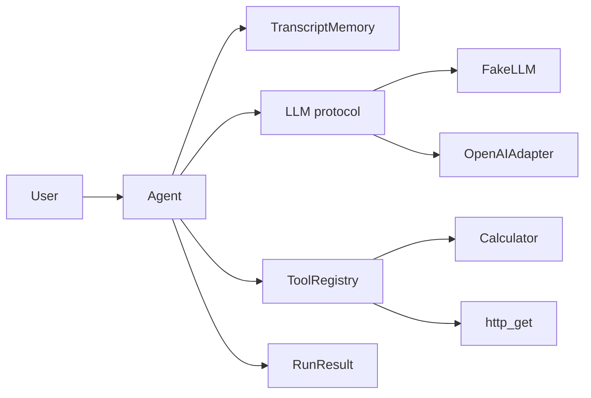

# agent-runtime-kit

**Python agent loop with tools, pluggable LLM, memory, and golden evals — portfolio kit for agentic AI systems.**

An honest MVP for recruiter-facing demos of agentic AI: a multi-step loop, a tool registry, short-term transcript memory, a deterministic `FakeLLM` for tests, and an optional OpenAI adapter. Not a LangGraph clone — no graph DSL, no heavy framework. Real code you can read in one sitting.

## Features

- **Agent loop** — messages, `max_steps`, tool registry (`@tool` / `register`), `RunResult` with steps, tool calls, final text, latency counters
- **Built-in tools** — `calculator` (AST-safe arithmetic) and `http_get` (timeout + size limit)
- **Pluggable LLM** — `LLM` protocol, `FakeLLM` for deterministic tests/demos, optional `OpenAIAdapter` behind `OPENAI_API_KEY`
- **Short-term memory** — ordered transcript buffer across steps
- **Golden evals** — fixed FakeLLM scenarios with expected tool use and answers
- **CI** — GitHub Actions runs pytest on Python 3.11+

## Architecture



**Loop (simplified):**

1. Append user message to memory
2. Call `llm.complete(messages, tools)`
3. If the assistant returns `tool_calls`, invoke each tool, append tool results, repeat
4. Otherwise treat content as the final answer and return `RunResult`
5. Stop early on `max_steps`

## Install

```bash
# clone
git clone https://github.com/gratycodes/agent-runtime-kit.git
cd agent-runtime-kit

python -m venv .venv
source .venv/bin/activate
pip install -e ".[dev]"

# optional OpenAI support
pip install -e ".[openai]"
```

Requires **Python 3.11+**.

## Demo

Deterministic FakeLLM scenario (no API key required):

```bash
python -m agent_runtime.demo
```

Expected shape of output: a calculator tool call for `(17 + 25) * 3`, then a final answer of `126`.

## Quick start (library)

```python
from agent_runtime import Agent, FakeLLM, FakeTurn, built_in_registry

llm = FakeLLM(
    script=[
        FakeTurn(
            tool_calls=[{
                "name": "calculator",
                "arguments": {"expression": "6 * 7"},
            }]
        ),
        FakeTurn(content="42"),
    ]
)
agent = Agent(llm=llm, tools=built_in_registry())
result = agent.run("What is 6*7?")
print(result.final_text)       # 42
print(result.tool_calls)       # [ToolCall(name='calculator', ...)]
print(result.total_latency_ms)
```

### Optional OpenAI

```python
import os
from agent_runtime import Agent, OpenAIAdapter, built_in_registry

assert os.environ.get("OPENAI_API_KEY"), "set OPENAI_API_KEY"
agent = Agent(llm=OpenAIAdapter(model="gpt-4o-mini"), tools=built_in_registry())
print(agent.run("What is 19*21?").final_text)
```

## Tests

```bash
pytest -q
```

Coverage includes:

- Agent loop (final answer, tool use, unknown tool, max_steps)
- Tool selection / calculator safety
- **3 golden eval cases** (`simple_arithmetic`, `nested_expression`, `no_tool_needed`)

## Design notes

| Choice | Why |
| --- | --- |
| Plain loop, not a graph | Interviewers can read the control flow without a framework mental model |
| `LLM` protocol + `FakeLLM` | Tests and demos stay deterministic; OpenAI is optional |
| AST calculator | Safer than `eval`; still shows tool-use plumbing |
| Bounded `http_get` | Timeout + byte cap so demos cannot hang or slur large bodies |
| `RunResult` counters | Latency and step traces make behavior inspectable |
| Golden evals | Small, fixed scenarios that fail loudly if tool wiring regresses |

**Out of scope (intentionally):** multi-agent orchestration, persistent long-term memory, streaming, production observability, prompt caching. Those belong in a product — this kit is the core loop.

## Project layout

```
src/agent_runtime/
  agent.py      # multi-step loop
  tools.py      # registry + calculator + http_get
  llm.py        # protocol, FakeLLM, OpenAIAdapter
  memory.py     # short-term transcript
  types.py      # Message, ToolCall, Step, RunResult
  demo.py       # python -m agent_runtime.demo
tests/
  test_agent.py
  test_tools.py
  test_golden_evals.py
```

## License

MIT
